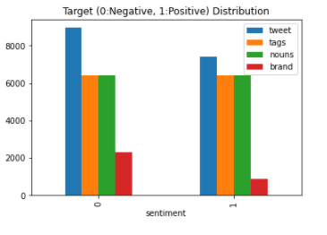
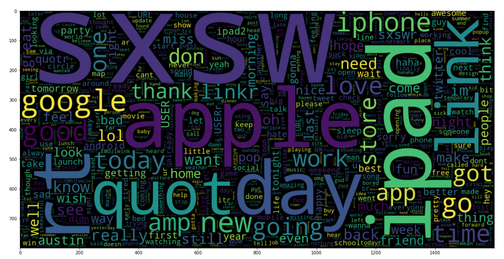

# Understanding Twitter Sentiment Analysis

## Overview

   For this project we wanted to better predict what kind of sentiment a twitter comment 
   had, between positive and negative.
   The data that we used can be found at 
   https://data.world/crowdflower/brands-and-product-emotions 
   and 
   https://www.kaggle.com/kazanova/sentiment140 

   When any particular event takes place you want to know how it was recieved, but going 
   through each individual tweet and understanding the sentiment can be time consumming
   and tiersome. So we decided to try and automate the process using natural language 
   processing.

   In order to preform this task we first needed to understand what kind of words someone
   would typically use to convey a particular type of sentiment. 

    
## Methodology
1. Gather and merge the data along sentiment and text and synthesize a more useable dataset
2. Perform EDA with statistical analysis to determine statistically tokenized words.
4. Test baseline model and tune to Accuracy
5. Test different models with different hyper perameters and use cross validation
6. Implement the different models to preform on the data set

## Results

   For this project we started with very skewed data, so we wanted to supplement this 
   data with a more equally distributed one.  
    
   This would allow us to gather more data on word choice along each sentiment and also 
   allowed us to drop neutral sentiment classified tweets.
   Once we were able to merge the datasets we moved on to cleaning the tweets with regex
   patterns, and lammentizing the words with tfidf. 
    
   We were also able to start tagging the tweets in regards to targeted nouns and entity
   recognition. Unfortunaly we weren't able to fully impliment these features but given 
   even one more day, would be able to clean and utilize these features.

   After this was done we moved on to trying out different models with the synthesized data. 
   Because we wanted our model to be able to predict both negative and possitive sentiment well
   We wanted to put an emphasis on accuracy score; however, because we wanted to highlight 
   negative sentiment tweet for further review we decided that when two models preformed 
   similarly we would choose the model that better identified negative sentiment.
   
   Our initial baseline model was a  Bernouli Naive Bayse classification, this gave us an
   accuracy score of 69%. Not a terrible score, but we though we could do better using different
   models. Next we chose SVC and got an accuracy score of 73%, slightly better, but we wanted one
   more model to make sure we would chose the correct one to processed with hyper parrameter tuning.
   Lastly we chose random forest 71%. This was a better accuracy score but upon further inspection 
   we saw that this was because it focused almost exclusively on negative classification. So we
   moved on with Logistic regression and SVC. 
    
   Next we moved on to hypertunning the parameters using grid search for these two models, after which 
   we were able to 73% and 73% for Logistic Regression and SVC respectively. Taking into consideration 
   the accuracy of the model with negative sentiment we decided to go with SVC.
   
## Modeling
Using Scikit-learn 6 classification models were crated.
- Logistic Regression 
- Logistic Regression with GridSearchCV
- Random Forest
- Bernouli Naive Bayse
- SVC
- SVC with GridSearchCV

It was determined that the SVC with GridSearchCV model perfromed the best and was utilized for the final implementation. 

## Conclusion
The synthesized data was analyzed and modeled. With regards to negative analysis we saw that when talking about a product 
in our data set it was more likely that they would have a negative sentiment, but if it was a post about just their general 
experiance it was more likely that they would have a possitve sentiment. 

## Future Work
-Tune the Model to better predict Possitive Sentimen
-Implement the tags we were able to classify but not use
-Implement CNN to better improve performance

## Repository Structure

    "├── README.md                    <- The top-level README for reviewers of this project\n",
    "├── EDA.ipynb               <- Notebook that gpes pver out modling process\n",
    "├── images                       <- Both sourced externally and generated from Code\n",       
    
**Authors**  
[Christian Corrales](https://github.com/ccorrales1228) 
[Kelvin Arellano](https://github.com/Kelvin-Arellano) 
